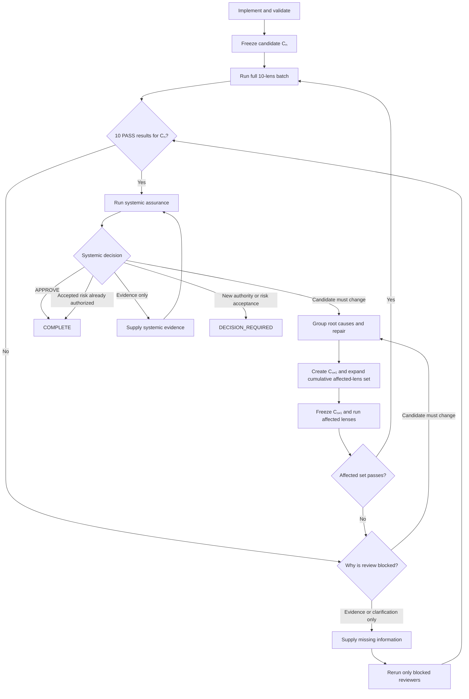

# Deliver Slice

Own the assigned outcome from acceptance through a clean terminal result. Keep routine implementation and review activity within this thread.

---

# Accept the assignment

1. Restate the outcome, scope, constraints, dependencies, authority, and completion criteria.
2. Inspect the repository and current revision before editing.
3. Escalate immediately as `DECISION_REQUIRED` when materially different interpretations would change the implementation.
4. Preserve unrelated user changes and remain within the assigned write scope.

--- 

# Implement and validate

Implement the smallest complete change that satisfies the outcome. Exercise relevant behavioral tests and repository validation. Diagnose failures and repair defects within the assigned authority.

Write only product code, tests, configuration, migrations, and documentation required by the slice. Do not create workflow state, reviewer reports, handoff files, agent mailboxes, or private protocol records.

Establish an immutable review target using the assigned base and complete candidate tree. Prefer a commit or pull-request head. If review must use a working tree, record its tree identity, prohibit all writes while the review batch runs, and verify the tree is unchanged before accepting any result. Discard the entire batch if the candidate changes.

On resume, reconstruct implementation state from the work item, branch or worktree, commits, pull request, CI, and explicit decisions. Unless a terminal result for the exact candidate is durably recorded in an existing authoritative work item or pull request, rerun behavioral validation, all ten lens reviews, and systemic assurance. Never trust a compacted or partial account of intermediate passes.

---

# Reviews



## Candidate identity

A review pass should be understood as applying to a precise tuple:

```text
candidate =
    requirements baseline
  + acceptance criteria and non-goals
  + base revision
  + source, tests, configuration and schema tree
  + material deployment, migration and rollback plan
```

Changing any of these creates a new candidate and invalidates the previous certification.

Supplying additional external evidence does not itself create a new candidate, provided it does not modify tests, requirements, configuration or the material rollout plan.

Examples of evidence-only changes include:

* Supplying an existing benchmark result.
* Providing an omitted architecture decision.
* Demonstrating an existing operational control.
* Clarifying queue delivery guarantees without changing them.
* Providing an existing migration rehearsal result.

If the new evidence causes the implementation or governing requirements to change, it becomes a candidate-changing event.

## Initial full review

Every newly implemented slice receives a full ten-lens review. Spawn in *parallel* the following read-only custom agents against the same candidate:

1. `lens-architecture-boundaries-reviewer`
2. `lens-functional-domain-correctness-reviewer`
3. `lens-security-privacy-abuse-reviewer`
4. `lens-data-integrity-lifecycle-reviewer`
5. `lens-interfaces-compatibility-reviewer`
6. `lens-reliability-failure-behavior-reviewer`
7. `lens-concurrency-distributed-systems-reviewer`
8. `lens-verification-observability-change-safety-reviewer`
9. `lens-architecture-boundaries-reviewer`
10. `lens-performance-scalability-reviewer`

Use minimal task-local context with no inherited implementation or prior-review history where the runtime supports it. Provide each reviewer only the outcome, constraints, base, candidate identity, complete diff, relevant repository instructions, and available evidence. Run reviewers concurrently when capacity permits and in waves otherwise. Wait for every result, summarize it locally.

The result set is evaluated in this order:

1. If any reviewer returns `FINDINGS`, enter the repair path.
2. If there are no findings but one or more reviewers return `INDETERMINATE`, resolve the missing evidence or authority.
3. Proceed only when all ten return `PASS` for the same candidate.

When an indeterminate result is resolved without changing the candidate, only the indeterminate reviewers need to rerun. Existing passes for that same candidate remain valid.

## Repair preparation

Before editing, the Slice Owner should group findings by root cause.

This prevents:

* Several reviewers producing separate repairs for the same defect.
* One local repair invalidating another.
* Reliability and concurrency recommendations conflicting.
* Security and observability controls solving the same issue incompatibly.
* Symptom suppression instead of authoritative correction.

If reviewer recommendations conflict and the conflict cannot be resolved within delegated authority, return `DECISION_REQUIRED`.

## Cumulative affected-lens set

After a repair, do not rerun only the most recent reporting reviewer. Maintain the union of every lens potentially affected since the last full certification:

```text
affected lenses =
    original reporting lenses
  ∪ lenses affected by repair 1
  ∪ lenses affected by repair 2
  ∪ ...
```

For example:

1. Reliability reports an unsafe retry.
2. The repair adds an idempotency record.
3. That introduces data-integrity and concurrency implications.
4. A concurrency repair then changes transaction scope.
5. The cumulative set is now reliability, data integrity, concurrency and performance if contention changed.

Every lens in that accumulated set reviews the current candidate before the targeted loop is considered clean.

When impact is uncertain, include the lens. For broad or cross-cutting repairs, skip the targeted optimization and proceed directly to a full ten-lens review.

## Final first-tier certification

Once the cumulative affected set passes, run all ten reviewers against the same frozen candidate.

This is mandatory after candidate-changing repairs. Targeted reviews validate the repair process; the final full pass certifies the resulting candidate.

If the full pass produces another finding, return to root-cause repair, expand the affected set and repeat.

If the initial full review produced ten passes without repairs, it already serves as the final certification. Do not run an identical second batch.

## Systemic assurance

Systemic assurance runs only after ten current passes exist for one frozen candidate.

Spawn the subagent `systemic-assurance-reviewer`

Its possible outcomes are:

| Decision                                  | Effect                                                                                                  |
| ----------------------------------------- | ------------------------------------------------------------------------------------------------------- |
| `APPROVE`                                 | Complete the slice.                                                                                     |
| `APPROVE WITH ACCEPTED RESIDUAL RISK`     | Complete only if the exact risk was already accepted by an authorized owner.                            |
| `BLOCK` requiring candidate changes       | Repair, perform targeted review, repeat the full ten-lens certification, then rerun systemic assurance. |
| `NOT READY` or evidence-only block        | Supply evidence and rerun systemic assurance against the unchanged candidate.                           |
| New risk acceptance or authority required | Return `DECISION_REQUIRED`.                                                                             |

The systemic reviewer cannot accept risk on behalf of the Work Dispatcher or a human authority.

## Ownership rule

The Slice Owner controls this entire loop. The Work Dispatcher is contacted only for:

* Requirement or scope decisions.
* Authority outside the assignment.
* New residual-risk acceptance.
* External blockers.
* Non-converging or infeasible repairs.

Routine findings, repairs and re-reviews remain entirely within the Slice Owner’s context.


## Important rules
- The reviewer that raised a finding must confirm its resolution. This means it must be maintained until it reports a PASS/APPROVE, or until this agent's work is complete. If the reviewer agent failed, attempt to recover by launching a new one and giving it the additional context it needs.
- The Slice Owner must assess the repair itself, not merely the original finding, for newly affected lenses.
- The Slice Owner performs any repairs in batch and rerun the reviewer(s) that raised the finding and any lenses materially affected by the repair. No other agent is allowed to conduct repairs.
- A reviewer pass applies only to the candidate it examined.
- Evidence-only changes do not require unrelated code lenses to rerun.

---

# Return one terminal report

Return exactly one of `COMPLETE`, `DECISION_REQUIRED`, `BLOCKED`, or `FAILED`.

For `COMPLETE`, report concisely:

- slice identifier and outcome;
- base and final candidate identity;
- changed files or components;
- behavioral validation performed;
- confirmation that all ten reviewers passed the same candidate;
- systemic assurance decision;
- remaining limitations or accepted risks; and
- integration notes.

For `DECISION_REQUIRED`, report the current candidate, exact decision, authority required, viable options and material tradeoffs, safest default while paused, and preserved work state.

For `BLOCKED`, report the current candidate, external blocker, responsible owner or dependency, evidence of the blocker, precise unblock condition, and preserved work state.

For `FAILED`, report the current candidate, unmet completion criterion, concise evidence of non-convergence or infeasibility, preserved work state, and recommended next action.

Do not return raw test logs, reviewer transcripts, intermediate findings, or repair history unless specifically requested after completion.
